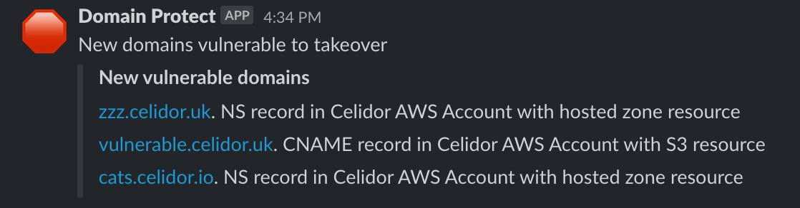

# domain-protect

* scan Amazon Route53 across an AWS Organization for domain records vulnerable to takeover
* scan [Cloudflare](docs/cloudflare.md) for vulnerable DNS records
* take over vulnerable subdomains yourself before attackers and bug bounty researchers
* automatically create known issues in [Bugcrowd](docs/bugcrowd.md) or [HackerOne](docs/hackerone.md)
* vulnerable domains in Google Cloud DNS can be detected by [Domain Protect for GCP](https://github.com/ovotech/domain-protect-gcp)

### blog posts
* [How we prevented subdomain takeovers and saved $000s](https://tech.ovoenergy.com/how-we-prevented-subdomain-takeovers-and-saved-000s/)
* [OVO vs. Bug Bounty researchers - round 2](https://tech.ovoenergy.com/ovo-vs-bug-bounty-researchers-round-2/)

### conference and meetup talks
* [OWASP London Chapter 2022](https://youtu.be/nw6uR0glJKk)
* [SANSCloudSecNext 2022](https://youtu.be/Boy8DYrC-Xw)
* [CloudSecurityLondon 2022](https://youtu.be/4Hg9bEvxTRo)

### deploy to security audit account

### scan your entire AWS Organization

### take over vulnerable domains in security account

<kbd>
  
</kbd>

### receive alerts by Slack or email

<kbd>
  
</kbd>

<kbd>
  
</kbd>

<kbd>
  
</kbd>

### deploy in your AWS Organization using GitHub Actions

### or manually scan from your laptop

## documentation
[Manual scans - AWS](manual_scans/aws/README.md) 
[Manual scans - CloudFlare](manual_scans/cloudflare/README.md) 
[Architecture](docs/architecture.md) 
[Database](docs/database.md) 
[Reports](docs/reports.md) 
[Automated takeover](docs/automated-takeover.md) *optional feature* 
[Cloudflare](docs/cloudflare.md) *optional feature* 
[Bugcrowd](docs/bugcrowd.md) *optional feature* 
[HackerOne](docs/hackerone.md) *optional feature* 
[Vulnerability types](docs/vulnerability-types.md) 
[Vulnerable A records (IP addresses)](docs/a-records.md) *optional feature* 
[Requirements](docs/requirements.md) 
[Installation](docs/installation.md) 
[Slack Webhooks](docs/slack-webhook.md) 
[AWS IAM policies](docs/aws-iam-policies.md) 
[CI/CD](docs/ci-cd.md) 
[Development](docs/development.md) 
[Code Standards](docs/code-standards.md) 
[Automated Tests](docs/automated-tests.md) 
[Manual Tests](docs/manual-tests.md) 

## limitations
* this tool cannot guarantee 100% protection against subdomain takeover
* it currently only scans Amazon Route53 and Cloudflare, and only checks a limited number of takeover types
* vulnerable domains in Google Cloud DNS can be detected by [Domain Protect for GCP](https://github.com/ovotech/domain-protect-gcp)
