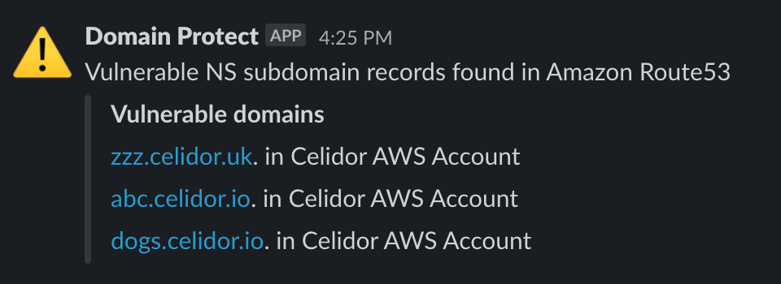

# domain-protect
scans Amazon Route53 across an AWS Organization for domain records vulnerable to takeover

### deploy to security audit account


### scan your entire AWS Organization


### receive alerts by Slack or email

<kbd>
  
</kbd>

### or manually scan from your laptop


## subdomain detection functionality
* scans Amazon Route53 Alias records to identify CloudFront distributions with missing S3 origin
* scans Amazon Route53 CNAME records to identify CloudFront distributions with missing S3 origin
* scans Amazon Route53 for ElasticBeanstalk Alias records vulnerable to takeover
* scans Amazon Route53 for ElasticBeanstalk CNAMES vulnerable to takeover
* scans Amazon Route53 for subdomain NS delegations vulnerable to takeover
* scans Amazon Route53 for S3 Alias records vulnerable to takeover
* scans Amazon Route53 for S3 CNAMES vulnerable to takeover
* scans Amazon Route53 to discover vulnerable CNAME records for Azure resources  
* scans Amazon Route53 to discover vulnerable CNAME records for Google Cloud resources

## options
1. scheduled lambda functions with email and Slack alerts, across an AWS Organization, deployed using Terraform
2. [manual scans](manual-scans/README.md) run from your laptop or CloudShell, in a single AWS account

## notifications
* Slack channel notification per vulnerability type, listing account names and vulnerable domains
* Email notification in JSON format with account names, account IDs and vulnerable domains by subscribing to SNS topic

## requirements
* Security audit account within AWS Organizations
* Security audit read-only role with an identical name in every AWS account of the Organization
* Storage bucket for Terraform state file
* Terraform 1.0.x

## usage
* replace the Terraform state S3 bucket fields in the command below as appropriate
* for local testing, duplicate terraform.tfvars.example, rename without the .example suffix
* enter details appropriate to your organization and save
* alternatively enter Terraform variables within your CI/CD pipeline

```
terraform init -backend-config=bucket=TERRAFORM_STATE_BUCKET -backend-config=key=TERRAFORM_STATE_KEY -backend-config=region=TERRAFORM_STATE_REGION
terraform workspace new dev
terraform plan
terraform apply
```

## AWS IAM policies
For least privilege access control, example AWS IAM policies are provided:
* [domain-protect audit policy](aws-iam-policies/domain-protect-audit.json) - attach to domain-protect audit role in every AWS account
* [domain-protect audit trust relationship](aws-iam-policies/domain-protect-audit-trust.json) - trust relationship domain-protect audit role in every AWS account
* [domain-protect deploy policy](aws-iam-policies/domain-protect-deploy.json) - attach to IAM group or role assumed by CI/CD pipeline

## adding new checks
* create a new subdirectory within the terraform-modules/lambda/code directory
* add Python code file with same name as the subdirectory
* add the name of the file without extension to ```var.lambdas``` in [variables.tf](variables.tf)
* add a subdirectory within the terraform-modules/lambda/build directory, following the existing naming pattern
* add a .gitkeep file into the new directory
* update the .gitignore file following the pattern of existing directories  
* apply Terraform

## adding notifications to extra Slack channels
* add an extra channel to your slack_channels variable list
* add an extra webhook URL or repeat the same webhook URL to your slack_webhook_urls variable list
* apply Terraform

## testing
* use multiple Terraform workspace environments, e.g. dev, prd
* use the ```slack_channels_dev``` variable for your dev environment to notify a test Slack channel
* for new subdomain takeover categories, create correctly configured and vulnerable domain names in Route53
* minimise the risk of malicious takeover by using a test domain, with domain names which are hard to enumerate
* remove any vulnerable domains as soon as possible

## ci/cd
* infrastructure has been deployed using CircleCI
* environment variables to be entered in CircleCI project settings:

| ENVIRONMENT VARIABLE            | EXAMPLE VALUE / COMMENT                          |
| ------------------------------- | -------------------------------------------------|
| AWS_ACCESS_KEY_ID               | using [domain-protect deploy policy](aws-iam-policies/domain-protect-deploy.json)|
| AWS_SECRET_ACCESS_KEY           | -                                                |
| TERRAFORM_STATE_BUCKET          | tfstate48903                                     |
| TERRAFORM_STATE_KEY             | domain-protect                                   |
| TERRAFORM_STATE_REGION          | us-east-1                                        |  
| TF_VAR_org_primary_account      | 012345678901                                     | 
| TF_VAR_security_audit_role_name | not needed if "domain-protect-audit" used        |
| TF_VAR_external_id              | only required if External ID is configured       |
| TF_VAR_slack_channels           | ["security-alerts"]                              |
| TF_VAR_slack_channels_dev       | ["security-alerts-dev"]                          |
| TF_VAR_slack_webhook_urls       | ["https://hooks.slack.com/services/XXX/XXX/XXX"] | 

* to validate an updated CircleCI configuration:
```
docker run -v `pwd`:/whatever circleci/circleci-cli circleci config validate /whatever/.circleci/config.yml
```

## limitations
* this tool cannot guarantee 100% protection against subdomain takeover
* it currently only scans Amazon Route53, and only checks a limited number of takeover types