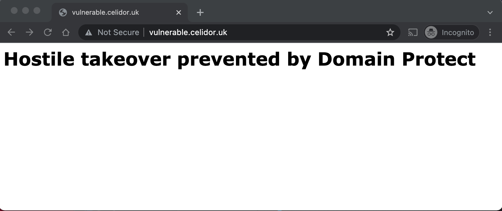
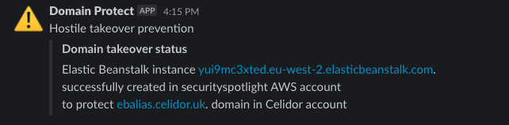
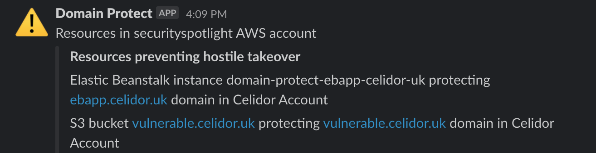

# domain-protect automated takeover
automated takeover of vulnerable domains with resources created in security account:
* Elastic Beanstalk environments
* S3 buckets

<kbd>
  
</kbd>

## Slack messages
* notification of takeover success or failure:

<kbd>
  
</kbd>

* daily reminder of resources in security account:

<kbd>
  
</kbd>

## automated takeover environments and options
Automated takeover components:
* takeover Lambda - takes over vulnerable domains by creating resources
* resources Lambda - reports on takeover resources in security account

## automated takeover environment and options
* Automated takeover components only deployed to the `prd` terraform workspace
* production workspace identifier can be changed by overriding `production_workspace` variable
* takeover can be turned off completely in all environments by setting variable `takeover = false`

## takeover event flow
Example takeover event flow:

| RESOURCE TYPE    | RESOURCE NAME                         | ACTIONS                                         |
| -----------------|---------------------------------------| ------------------------------------------------|
| EventBridge      | domain-protect-cname-s3-prd           | triggers cname-s3 Lambda function once per hour | 
| Lambda function  | domain-protect-cname-s3-prd           | scans Route53 in all AWS accounts               |
|                  |                                       | tests for CNAME to missing S3 bucket            |
|                  |                                       | sends vulnerability details to SNS topic        |
| SNS topic        | domain-protect-prd                    | publishes vulnerability details in JSON format  |
| Lambda function  | domain-protect-slack-channel-prd      | subscribes to SNS topic                         |
|                  |                                       | sends Slack notification of vulnerable domain   |                 
| Lambda function  | domain-protect-takeover-prd           | subscribes to SNS topic domain-protect-prd      |
|                  |                                       | deploys CloudFormation stack for S3 bucket      |
|                  |                                       | uploads content to S3 bucket                    |
|                  |                                       | tests for successful takeover                   |
|                  |                                       | sends takeover details to SNS topic             |
| CloudFormation   | domain-protect-vulnerable-example-com | creates takeover S3 bucket                      |
|                  |                                       | CloudFormation tags for takeover metadata       |
| S3 bucket        | vulnerable.example.com                | prevents hostile takeover                       |
| SNS topic        | domain-protect-prd                    | publishes takeover details in JSON format       |
| Lambda function  | domain-protect-slack-channel-prd      | subscribes to SNS topic                         |
|                  |                                       | sends Slack notification of takeover            |
| EventBridge      | domain-protect-cname-s3-prd           | triggers resources Lambda function once per day | 
| Lambda function  | domain-protect-resources-prd          | scans CloudFormation stacks in security account |
|                  |                                       | sends takeover resource details to SNS topic    |
| SNS topic        | domain-protect-prd                    | publishes resource details in JSON format       |
| Lambda function  | domain-protect-slack-channel-prd      | subscribes to SNS topic                         |
|                  |                                       | sends Slack notification of takeover resources  |

## Domain Protect tests supporting automated takeover
* Alias records for CloudFront distributions with missing S3 origin
* CNAME records for CloudFront distributions with missing S3 origin
* Elastic Beanstalk Alias records vulnerable to takeover
* Elastic Beanstalk CNAMES vulnerable to takeover
* S3 Alias records vulnerable to takeover
* S3 CNAMES vulnerable to takeover

## Deleting takeover resources
To minimise costs these tasks should be done as quickly as possible:
* fix the vulnerability by correcting DNS
* in the case of S3, empty the S3 bucket manually via the console
* delete the CloudFormation stack manually via the console

## Adding takeover feature to existing deployment
If you have previously deployed a detection only environment:
* add the `cloudfront:ListDistributions` permission to the [audit policy](aws-iam-policies/domain-protect-audit.json) in every account
* ensure your production Terraform workspace is `prd`
* alternatively add your actual workspace name as the value of the `production_workspace` variable
* apply Terraform