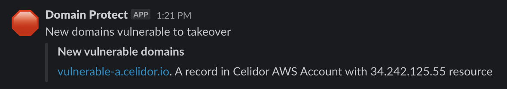
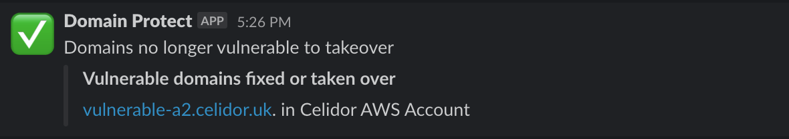
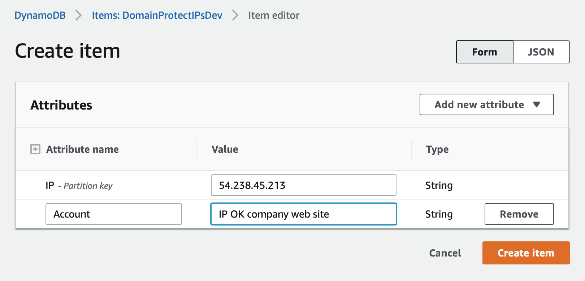

# Vulnerable A records (IP addresses)
*optional feature turned off by default*

* detects A records pointing to AWS IP addresses no longer in use within organisation
  * Elastic IP addresses
  * EC2 instances with public IP addresses
  * Global Accelerator IP addresses 
* automated takeover not supported





## How an A record becomes vulnerable
A records pointing to an IPv4 address can be vulnerable to subdomain takeover:

* engineer creates EC2 instance with public IP address
* engineer creates Route53 A record pointing to address
* engineer deletes EC2 instance, releasing IP address
* engineer forgets to remove Route53 DNS record
* attacker creates EC2 instance in own AWS account, with same IP address
* company DNS record now points to attacker's virtual machine

## How Domain Protect determines if A record is vulnerable
* decision flow designed to minimise false positives
* only detects certain types of A record vulnerabilities


## Domain Protect IP address database
* DynamoDB database table for IP addresses in Organization
* separate from vulnerability DynamoDB table


## Record IP address as OK
The A record check may create false positive alerts. 

If A record points to legitimate IP address, e.g. in a service provider's AWS account:
* manually create item in IP address DynamoDB database
* enter IP address known to be authorised
* create Account field with text starting `IP OK`
* item must be manually removed when resource is decommissioned



## Enabling A record feature
* set Terraform variable in your CI/CD pipeline or tfvars file:
```
ip_address = true
```
* apply Terraform

## Optimising cost and performance
Optional Terraform variables can be entered in your CI/CD pipeline or tfvars file to optimise performance and cost:

* `ip_schedule` can be reduced from `24 hours` for improved security at greater cost
* `ip_time_limit` can be reduced from `48` hours for improved security but higher risk of false positives
* `allowed_regions` can be limited to those allowed by Service Control Policies, to reduce Lambda execution time and cost

[back to README](../README.md)