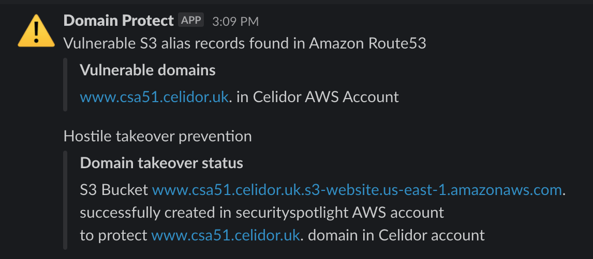

# Automated takeover
* take over vulnerable subdomains yourself before attackers and bug bounty researchers
* automated takeover with resources created in security account

<kbd>
  
</kbd>

## Slack messages
* notification of takeover success or failure:

<kbd>
  
</kbd>

* daily report of resources in security account:

<kbd>
  
</kbd>

## supported resource types
* Elastic Beanstalk environments
* S3 buckets

## Domain Protect tests supporting automated takeover
* Alias records for CloudFront distributions with missing S3 origin
* CNAME records for CloudFront distributions with missing S3 origin
* Elastic Beanstalk Alias records vulnerable to takeover
* Elastic Beanstalk CNAMES vulnerable to takeover
* S3 Alias records vulnerable to takeover
* S3 CNAMES vulnerable to takeover
* Cloudflare CNAMES for S3 buckets and Elastic Beanstalk environments

## Deleting takeover resources
To minimise costs these tasks should be done as quickly as possible:
* fix the vulnerability by correcting DNS
* in the case of S3, empty the S3 bucket manually via the console
* delete the CloudFormation stack manually via the console

## automated takeover environment and options
* Automated takeover components only deployed to the `prd` terraform workspace
* production workspace identifier can be changed by overriding `production_workspace` variable
* takeover can be turned off completely in all environments by setting variable `takeover = false`

## automated takeover components
Automated takeover components:
* takeover Lambda - takes over vulnerable domains by creating resources
* resources Lambda - reports on takeover resources in security account

## takeover event flow
Example takeover event flow:

| RESOURCE TYPE    | RESOURCE NAME                         | ACTIONS                                         |
| -----------------|---------------------------------------| ------------------------------------------------|
| EventBridge      | domain-protect-accounts-prd           | triggers accounts Lambda function once per hour | 
| Lambda function  | domain-protect-accounts-prd           | lists AWS accounts in Organization              |
| Step Function  | domain-protect-scan-prd                 | triggers Lambda for every AWS account           |
| Lambda function  | domain-protect-scan-prd               | scans Route53 in AWS account                    |
|                  |                                       | detects vulnerable CNAME for missing S3 bucket  |
|                  |                                       | sends vulnerability details to SNS topic        |
|                  |                                       | reads and writes to DynamoDB                    |
| DynamoDB         | DomainProtectVulnerableDomainsPrd     | stores vulnerability information                |
| SNS topic        | domain-protect-prd                    | publishes vulnerability details in JSON format  |
| Lambda function  | domain-protect-slack-channel-prd      | subscribes to SNS topic                         |
|                  |                                       | sends Slack notification of vulnerable domain|                 
| Lambda function  | domain-protect-takeover-prd           | subscribes to SNS topic domain-protect-prd      |
|                  |                                       | deploys CloudFormation stack for S3 bucket      |
|                  |                                       | uploads content to S3 bucket                    |
|                  |                                       | tests for successful takeover                   |
|                  |                                       | sends takeover details to SNS topic             |
| CloudFormation   | domain-protect-vulnerable-example-com | creates takeover S3 bucket                      |
|                  |                                       | CloudFormation tags for takeover metadata       |
| S3 bucket        | vulnerable.example.com                | prevents hostile takeover                       |
| SNS topic        | domain-protect-prd                    | publishes takeover details in JSON format       |
| Lambda function  | domain-protect-slack-channel-prd      | subscribes to SNS topic                         |
|                  |                                       | sends Slack notification of takeover            |
| EventBridge      | domain-protect-cname-s3-prd           | triggers resources Lambda function once per day | 
| Lambda function  | domain-protect-resources-prd          | scans CloudFormation stacks in security account |
|                  |                                       | sends takeover resource details to SNS topic    |
| SNS topic        | domain-protect-prd                    | publishes resource details in JSON format       |
| Lambda function  | domain-protect-slack-channel-prd      | subscribes to SNS topic                         |
|                  |                                       | sends Slack notification of takeover resources  |

## Adding takeover feature to existing deployment
If you have previously deployed a detection only environment:
* add the `cloudfront:ListDistributions` permission to the [audit policy](../aws-iam-policies/domain-protect-audit.json) in every account
* update line 59 of the [domain-protect-deploy policy](../aws-iam-policies/domain-protect-deploy.json) in security account
* ensure your production Terraform workspace is `prd`
* alternatively add your actual workspace name as the value of the `production_workspace` variable
* apply Terraform

## Service Control Policies
Ensure AWS Organization Service Control Policies applied to security account allow:
* creation of takeover resources, i.e. S3 buckets and Elastic Beanstalk environments
* all regions used by any other AWS account in the Organization

## S3 Block Public Access
* S3 Block Public Access must not be turned on at the account level in the security account
* takeover S3 buckets need to be public for correct operation

[back to README](../README.md)