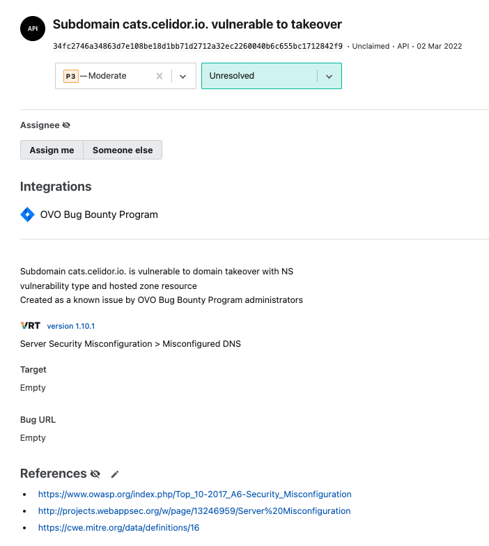
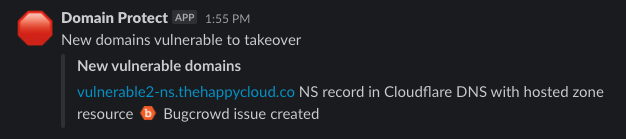
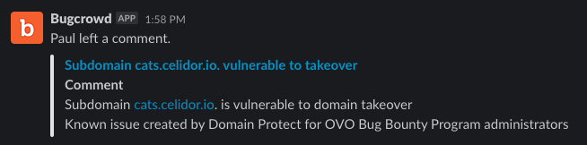

# Bugcrowd
*Bugcrowd integration is an optional feature turned off by default*
*You can enable Bugcrowd integration, or HackerOne integration, but not both*

## What is Bugcrowd?
* [Bugcrowd](https://bugcrowd.com) is an outsourced security platform and managed Bug Bounty service

## Why integrate with Bugcrowd?
* Domain Protect automatically creates findings as known issues in Bugcrowd using the [Bugcrowd API](https://docs.bugcrowd.com/api/getting-started/)
* if a researcher submits a similar finding after Domain Protect, their submission can be marked as a Duplicate
* reduces payouts to Bug Bounty researchers







## When are Bugcrowd issues created?
* to avoid duplicate issues, only your production environment will be integrated with Bugcrowd
* by default this will be the `prd` Terraform workspace
* if you have chosen a different Terraform workspace name for production, update Terraform variable:
```
production_workspace = "prd"
```
* Bugcrowd issues are only created for vulnerability types which don't support automated takeover

## How to enable Bugcrowd integration
* create a service account, e.g. domain-protect@company.com and add as an administrator of your Bugcrowd team
* log in to Bugcrowd as the service account user
* create an API token following [Bugcrowd instructions](https://docs.bugcrowd.com/api/getting-started/)
* select API version `2021-10-28`
* set Terraform variables in your CI/CD pipeline or tfvars file, e.g.

```
bugcrowd         = "enabled"
bugcrowd_api_key = "xxxxxxx-xxxxxxx-xxxxxxx-xxxxxxx"
bugcrowd_email   = "domain-protect@company.com"
```
* apply Terraform

## Bugcrowd emoji in Slack
* Create a custom emoji in Slack using the [Bugcrowd image](../docs/slack/bugcrowd.png)
* Name the emoji `:bugcrowd:`

## Manual tasks in Bugcrowd
You still need to do the following tasks manually using the Bugcrowd console:
* mark issues submitted by researchers as duplicates
* only do this if the Domain Protect issue was submitted first
* link to the Domain Protect issue as the duplicate reference
* after vulnerability is fixed, change status to `resolved`

[back to README](../README.md)
