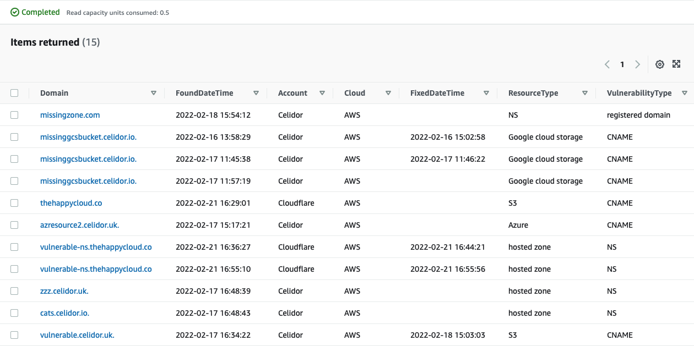

# Database

<kbd>
  
</kbd>

* Vulnerability Database uses DynamoDB
* Lambda function `domain-protect-scan-prd` queries database to see if a vulnerability is already known
* If vulnerability is new, it writes details to the database
* Lambda function `domain-protect-update-prd` scans database for unfixed vulnerabilities
* If a vulnerability is fixed or taken over, it adds fixed date to the database item
* DynamoDB table has provisioned capacity with default values of 3 RCU and 2 WCU
* RCU and WCU values can be changed using Terraform variables