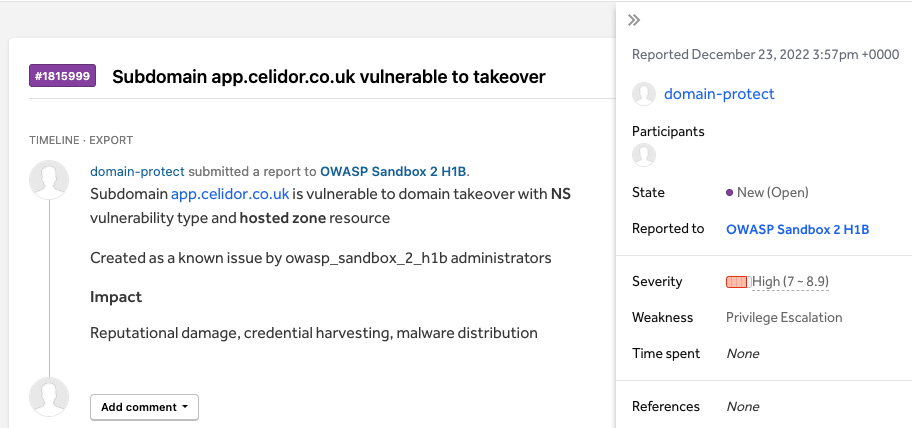
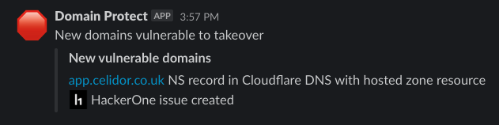
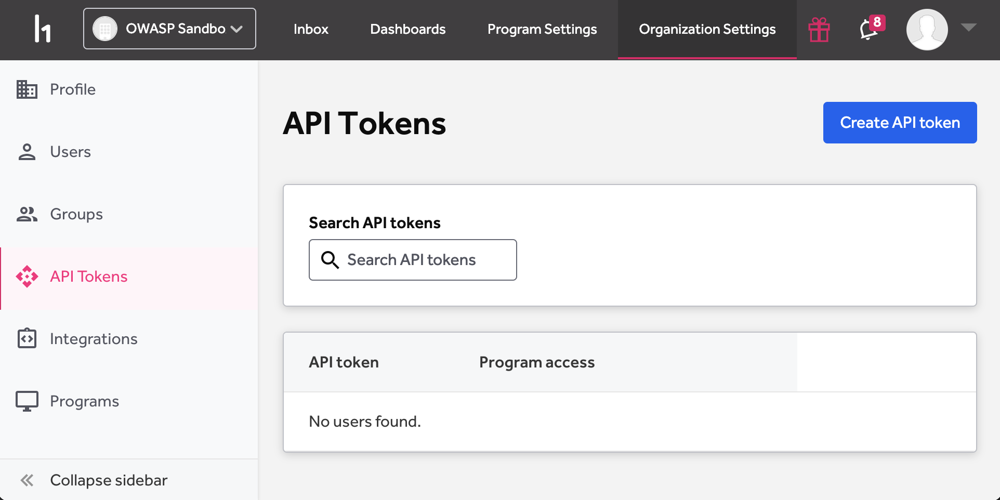
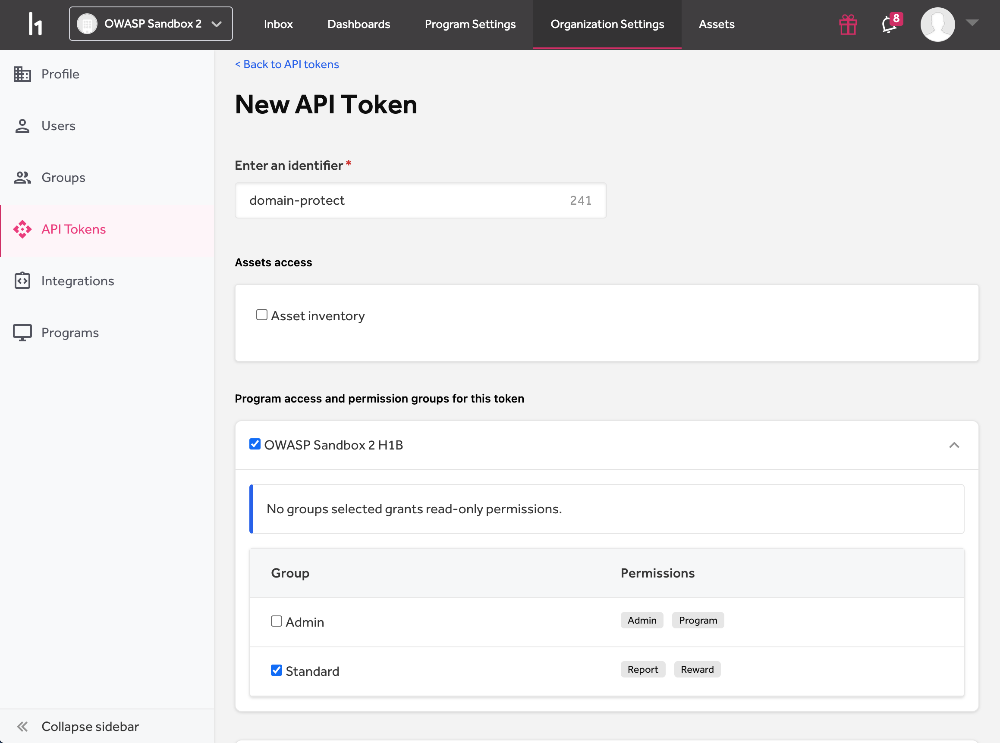
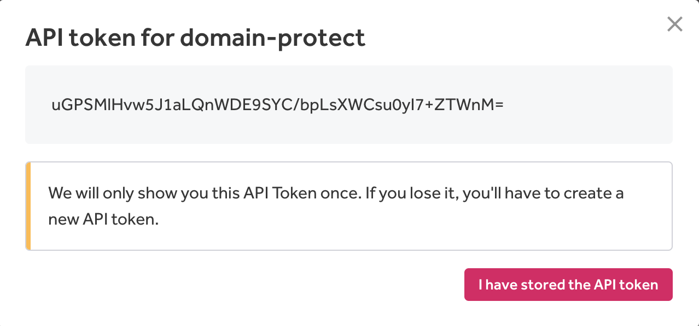
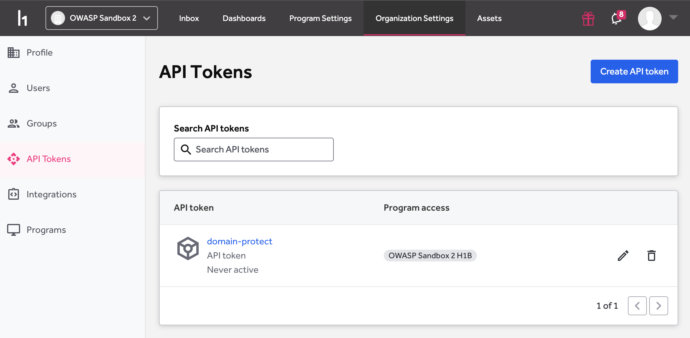

# HackerOne
*HackerOne integration is an optional feature turned off by default*  
*You can enable HackerOne integration, or Bugcrowd integration, but not both*

## What is HackerOne?
* [HackerOne](https://hackerone.com) is an outsourced security service combining the security expertise of ethical hackers with asset discovery and continuous assessment
to help organisations improve their security and stay ahead of threats

## Why integrate with HackerOne?
* Domain Protect automatically creates findings as known issues in HackerOne using the [HackerOne API](https://api.hackerone.com/)
* if a researcher submits a similar finding after Domain Protect, their submission can be marked as a Duplicate
* reduces payouts to Bug Bounty researchers





## When are HackerOne issues created?
* to avoid duplicate issues, only your production environment will be integrated with HackerOne
* by default this will be the `prd` Terraform workspace
* if you have chosen a different Terraform workspace name for production, update Terraform variable:
```
production_workspace = "prd"
```
* HackerOne issues are only created for vulnerability types which don't support automated takeover

## How to enable HackerOne integration

* Log in to HackerOne as an org admin, select Organization Settings, API Tokens
* Press Create API token



* Enter `domain-protect` as the identifier (or alternative if configured in `project` Terraform variable)
* Select your HackerOne Bug Bounty program, e.g. `OWASP Sandbox 2 H1B`
* select Standard permissions



* press Create API Token



* copy the API token and store securely
* press I have stored the API token



* set Terraform variables in your CI/CD pipeline or tfvars file, e.g.

```
hackerone           = "enabled"
hackerone_api_token = "xxxxxxx-xxxxxxx-xxxxxxx-xxxxxxx"
```
* apply Terraform

## HackerOne emoji in Slack
* Create a custom emoji in Slack using the [HackerOne image](../docs/slack/hackerone.png)
* Name the emoji `:hackerone:`

## Manual tasks in HackerOne
You still need to do the following tasks manually using the HackerOne console:
* mark issues submitted by researchers as duplicates
* only do this if Domain Protect issue was submitted first
* link to the Domain Protect issue as the duplicate reference
* after vulnerability is fixed, change status to `Resolved (Closed)`

[back to README](../README.md)
