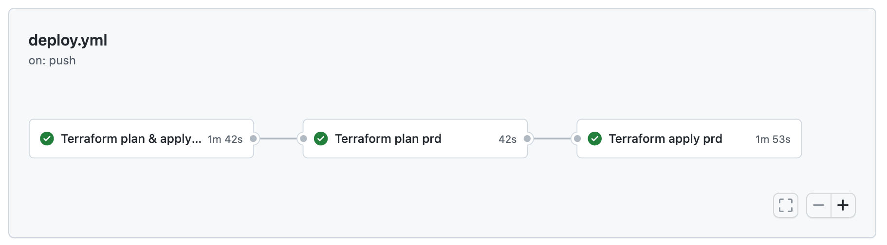

# Installation

## GitHub Actions (recommended)



* deploy Domain Protect in your AWS Organization
* no need to clone or fork Domain Protect
* internal / private deployment repository to protect sensitive information
* uses OpenID Connect - no IAM user with long-lived access keys
* update to latest version of Domain Protect any time by running pipeline

Follow detailed instructions in separate [Domain Protect Deploy](https://github.com/domain-protect/domain-protect-deploy) repository with GitHub Actions deployment workflow

## Manual installation (not recommended)

* replace the Terraform state S3 bucket fields in the command below as appropriate
* for local testing, duplicate terraform.tfvars.example, rename without the .example suffix
* enter details appropriate to your organization and save
* alternatively enter Terraform variables within your CI/CD pipeline
* deploy development environment for detection only
* default scan schedule for dev environment is 12 hours
```
terraform init -backend-config=bucket=TERRAFORM_STATE_BUCKET -backend-config=key=TERRAFORM_STATE_KEY -backend-config=region=TERRAFORM_STATE_REGION
terraform workspace new dev
terraform plan
terraform apply
```
* deploy production environment for detection and automated takeover
* default scan schedule for prd environment is 60 minutes
```
terraform workspace new prd
terraform plan
terraform apply
```

## adding notifications to extra Slack channels
* add an extra channel to your slack_channels variable list
* add an extra webhook URL or repeat the same webhook URL to your slack_webhook_urls variable list
* apply Terraform

[back to README](../README.md)