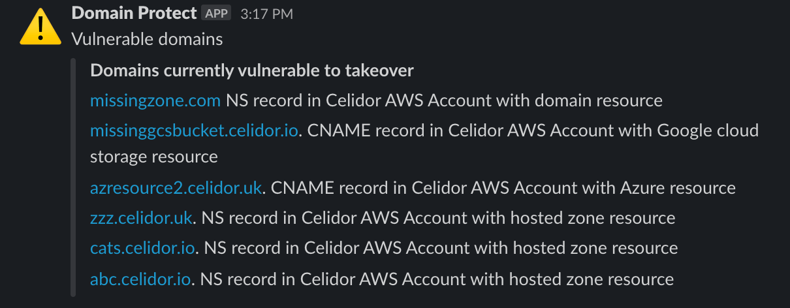
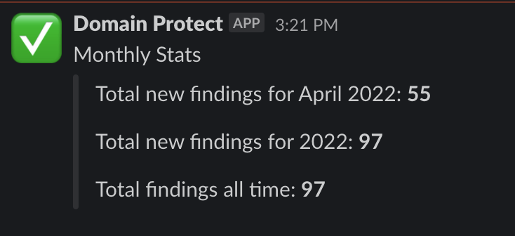

# Reports

Domain protect generates the following regular reports, in addition to notifications for new and fixed vulnerabilities.  Each report is generated and sent to the SNS topic as a JSON object, which is then picked up by the [notify lambda](../terraform-modules/lambda-slack/code/notify/notify.py) and sent to Slack.

## Current Vulnerabilities (Daily)
This daily report sends a message to Slack listing the currently known vulnerable domains that require fixes.  To change the frequency of this report from the default 24 hours, use the `reports_schedule` Terraform variable

<kbd>
  
</kbd>

## Takeover Resources (Daily)
This daily report lists the resources that are currently being used to prevent domain takeover.  This can be useful for managing costs associated with having the resources running.  To change the frequency of this report from the default 24 hours, use the `reports_schedule` Terraform variable

<kbd>
  
</kbd>

## Stats (Monthly)
This monthly report runs on the first of each month and lists number of domains takeovers that have been prevented in the last month, the current calendar year, and all time.  To change the frequency of this report from the default value, use the `stats_schedule` Terraform variable

<kbd>
  
</kbd>

[back to README](../README.md)