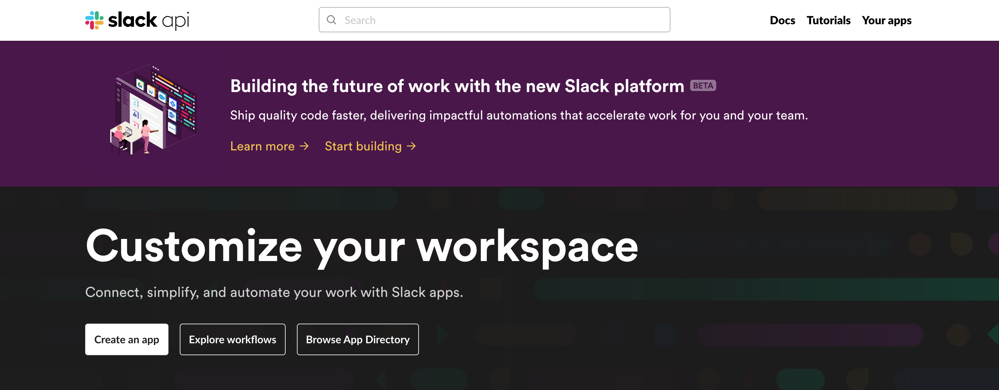
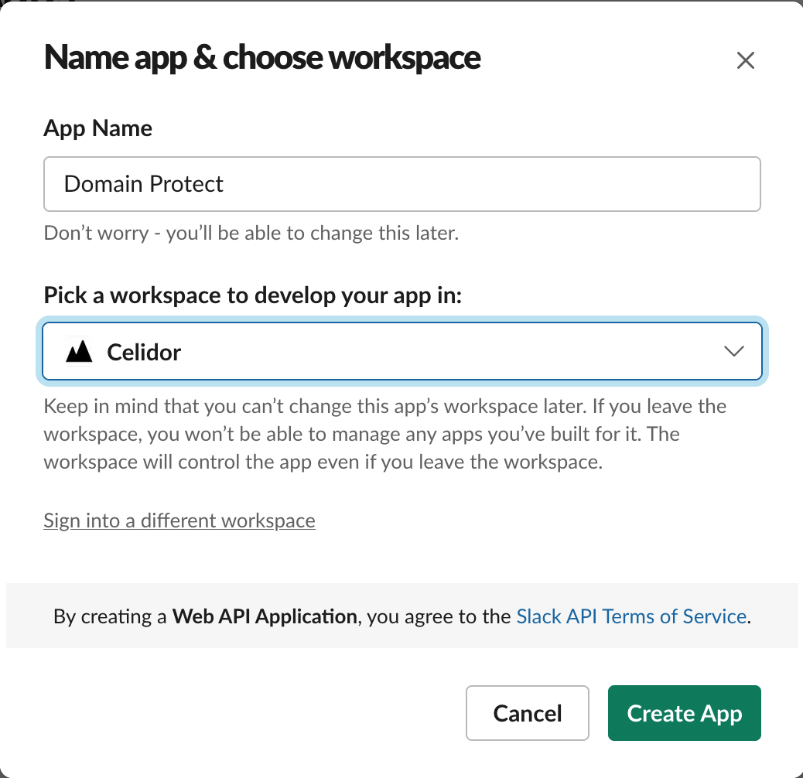
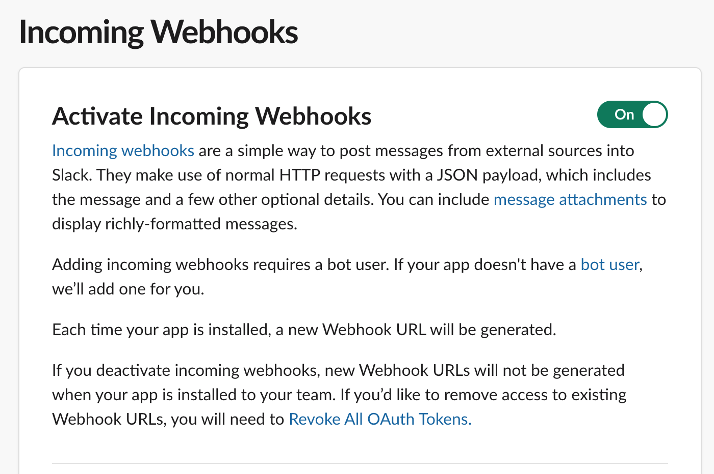
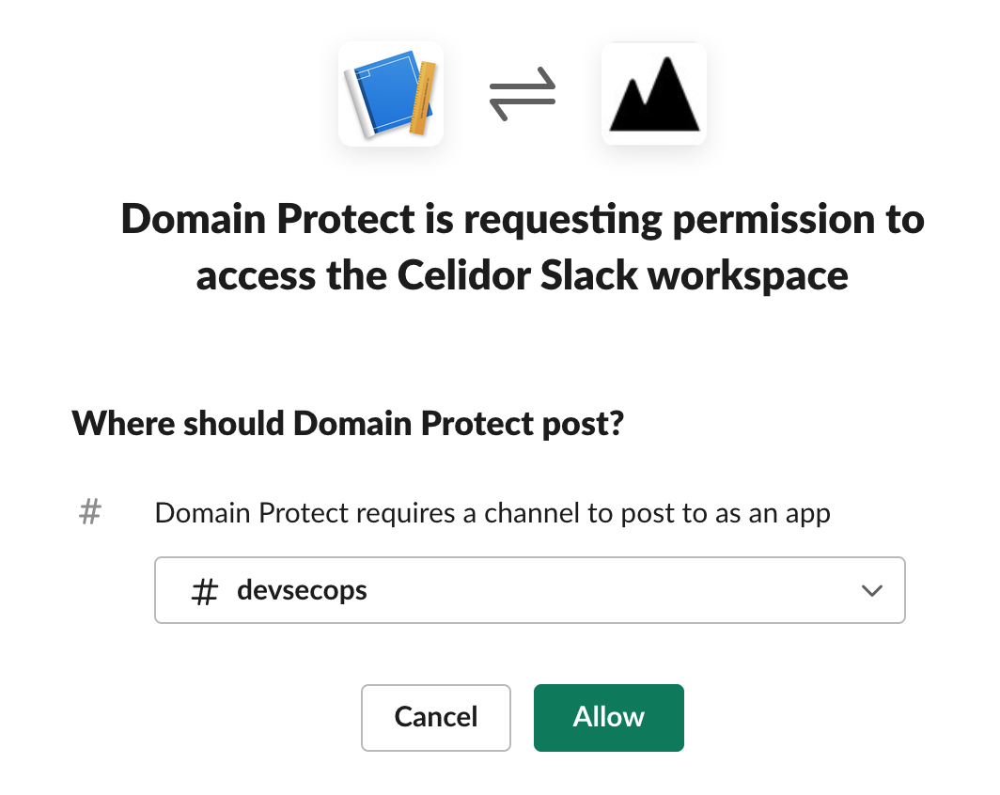
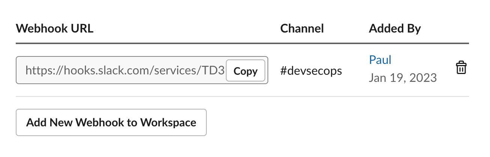
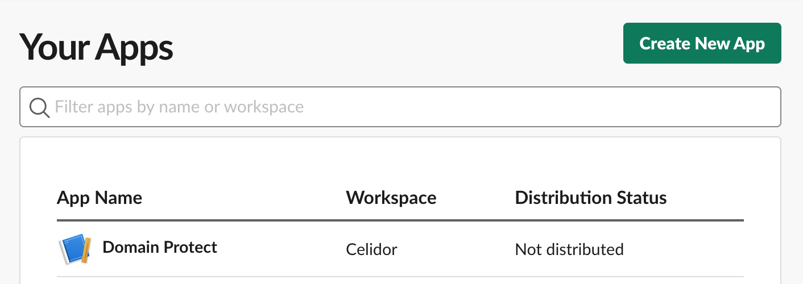
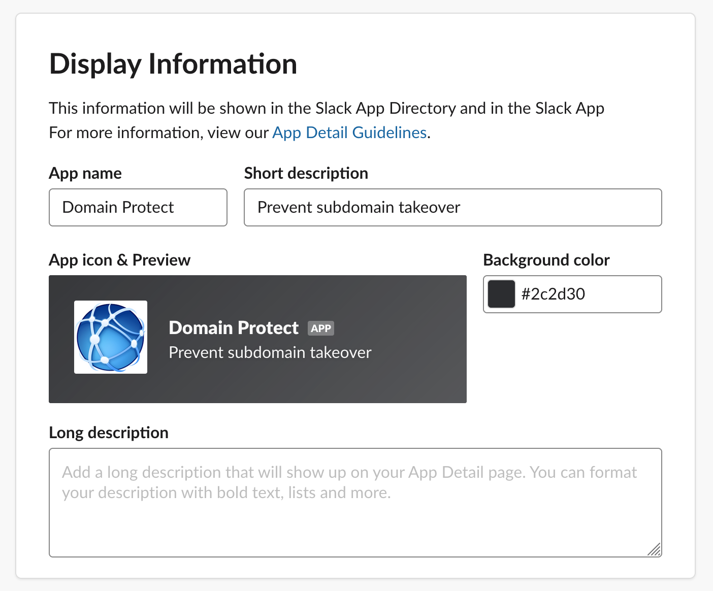
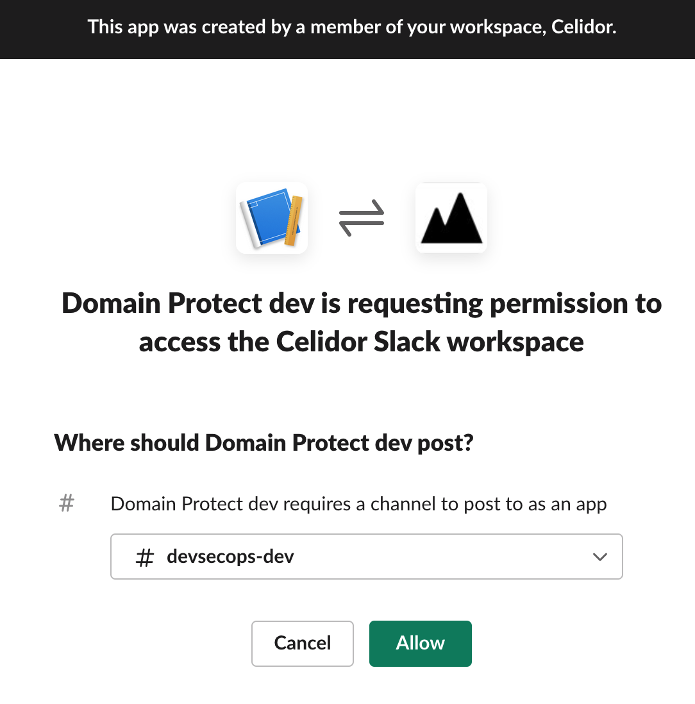
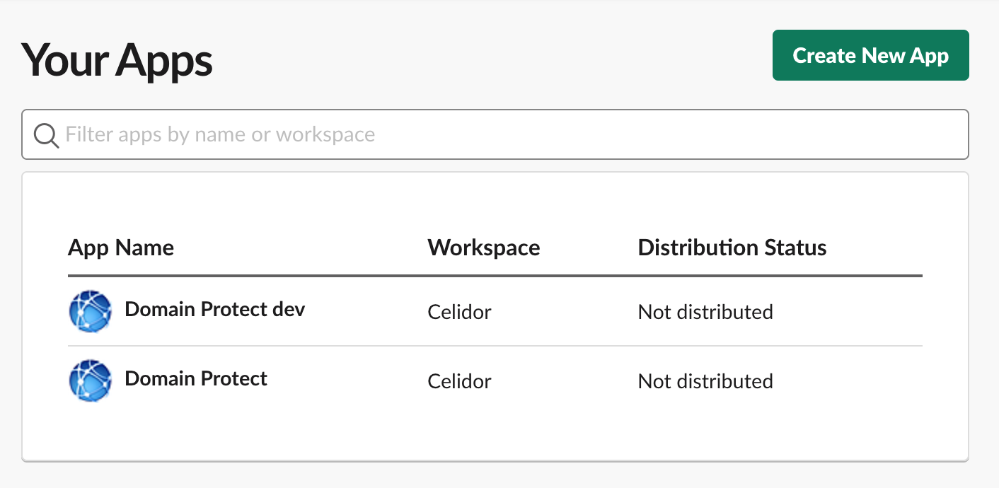

# Slack Webhook

A Slack webhook is required for Domain Protect notifications, there are two options:

* Slack app
* legacy Slack webhook (not recommended)

If using a Slack app, to ensure correct formatting set Terraform variable `slack_webhook_type = "app"`

## Slack Webhook app

* in your Slack client menu panel, select More, Apps, App Directory, Build

* press Create an app
* choose From scratch
* name App `Domain Protect`
* choose Slack Workspace for your organisation

* press Create App
* select Incoming Webhooks

* move slider to On
* press Add New Webhook to Workspace

* select channel
* press Allow

* copy webhook URL to a safe location
* you'll see Domain Protect in Your Apps

* select the Domain Protect app
* scroll down to Display Information
* at description, add `Preent subdomain takeover`
* add the Domain Protect Slack [App Icon](./slack/domain-protect-icon.png) from this repository
* for background color enter `#2c2d30`

* save changes

### Additional Slack channels
* repeat the above for every channel
* each channel needs its own app and webhook URL
* app names do not have to be unique

* all apps can be seen in Your Apps

## Legacy Slack webhook (not recommended)

Using a legacy Slack webhook is not recommended, as it may stop working when the person who created it leaves the organisation.

To create a legacy webhook:

* in your Slack client menu panel, select More, Apps, App Directory
* in the search bar, type `incoming webhook`
* select Incoming WebHooks
* add to Slack
* record the webhook URL

A single legacy Slack webhook can be used for all Slack channels 