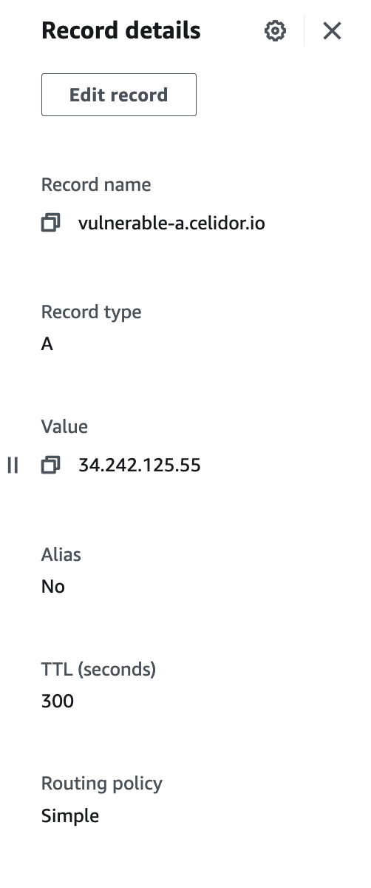

# A Record - Elastic IP / EC2 public IP
* ensure that an IP address scan has completed and there is at least one IP address in the IP address database
* download the [latest list of Amazon IP addresses](https://ip-ranges.amazonaws.com/ip-ranges.json)
* select an IPv4 address in a network with `"service": "EC2"` not already in use within the organisation
* create A record pointing to IP address in Route53

[Back to Manual Tests](../manual-tests.md)
