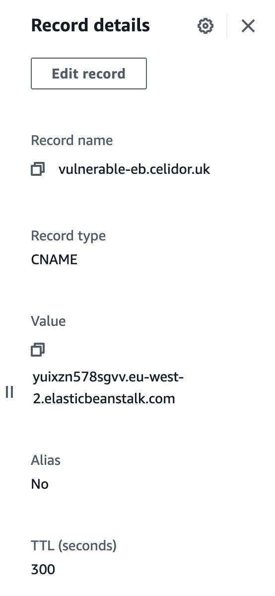

# CNAME Elastic Beanstalk
* Amazon Route53, hosted zone
* Create a CNAME pointing to a missing Elastic Beanstalk environment

* wait for an Elastic Beanstalk environment to be created by automatic takeover
* remove the DNS record and takeover Elastic Beanstalk environment as soon as possible to minimise costs

[Back to Tests](../tests.md)
