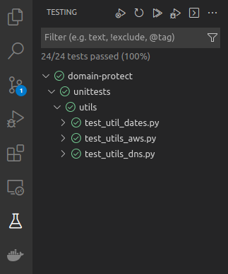

# Unit Tests

## Overview

Domain protect uses `pytest` to run unit tests against the code, and will fail the build if any tests fail.  All unit tests live under the `unittest` folder in the root of the solution.

## Running tests locally

For running tests locally you have 2 options, via the command line or in vscode (there are other IDEs available however we won't document them here).

For both of these it's recommended you run them from within a virtual env by running the following:

```
python3 -m venv .venv
source .venv/bin/activate
pip install -r requirements-dev.txt
```

### Command line

With the above steps complete simply run the command `pytest unittest` from the root of the project.

### VS Code

* Install the [python extension for vscode](https://marketplace.visualstudio.com/items?itemName=ms-python.python)
* Set up vscode to use pytest and set the root to the `unittest` folder
    * Either do this through the vscode settings UI
    * or paste the following JSON into `./vscode/settings.json`:
    ```
    {
        "python.testing.unittestEnabled": false,
        "python.testing.pytestEnabled": true,
        "python.testing.pytestArgs": [
            "unittests"
        ]
    }
    ```
* Go to the testing tab on the left menu and from there you can run all the tests using the "Run Tests" button at the top

<kbd>
  
</kbd>


## Creating new tests

* All new code should have unit tests - if possible follow test driven development (TDD) methodologies to ensure high test coverage
* New unit tests must be created under the unittests folder at the root of the solution
* The folder structure under the unittests folder must follow the folder structure of the solution (i.e. tests for a file under utils must live in unittests/utils)
* Test files must be named `test_[name_of_file_under_test]` - i.e. a test for the `utils_dates.py` file lives in `test_utils_dates.py`
* Each test must be a new function, no test classes
* Test functions names must follow the pattern `test_[function_under_test]_[description_of_assertion]` - e.g. `test_generate_role_arn_puts_role_at_the_end`
* Tests must follow the Arrange - Act - Assert pattern
* Unit tests should each only test one thing, and mock out any dependencies to keep them isolated.  Prefer multiple tests over fewer, larger tests
* Use the `patch` attribute from `unittest.mock` to inject dependencies into your tests
* Where required use the built-in unittest.mock assertions to validate calls - i.e. `mock_object.assert_called_once_with(arg)`
* Prefer black box testing over white/grey box testing where possible.  This will lead to developing smaller pure functions which are easier to test, grok, have no side effects, and the tests will be less brittle
* Assertions must use the assertpy library
* Unit test files must follow the same formatting and coding standards as code files

[back to README](../README.md)