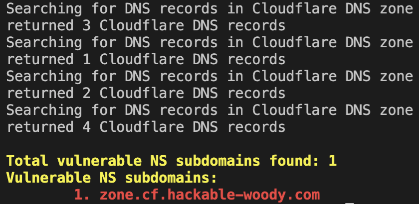
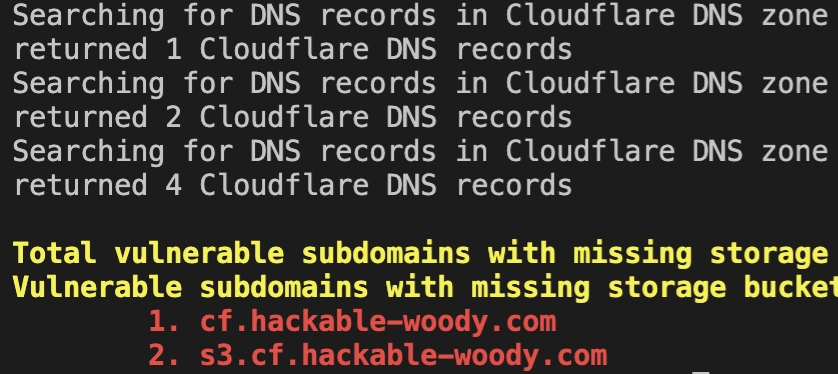
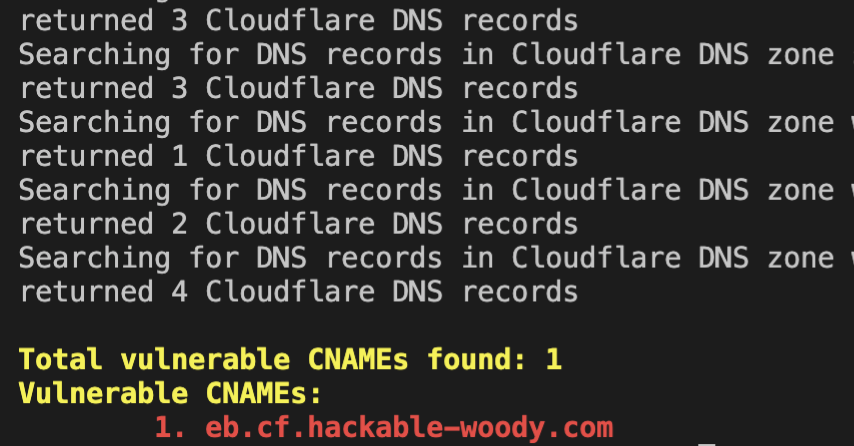

# domain-protect Cloudflare manual scans
scans Cloudflare to detect:
* Subdomain NS delegations vulnerable to takeover
* Subdomains pointing to missing storage buckets
* Vulnerable CNAME records

## Python setup
* optionally create and activate a virtual environment
```
python -m venv .venv
source .venv/bin/activate
```
* install dependencies
```
pip install -r manual_scans/cloudflare/requirements.txt
```
* set PYTHONPATH to import modules
* identify your current path from the root of the domain-protect directory
```
$ pwd
/Users/paul/src/github.com/ovotech/domain-protect
```
* set PYTHONPATH environment variable
```
$ export PYTHONPATH="${PYTHONPATH}:/Users/paul/src/github.com/domain-protect/domain-protect"
```
* or as a single command from the root dir
```
export PYTHONPATH=${PYTHONPATH}:$(pwd)
```
* run manual scans from root of domain-protect folder

## Set credentials
* In the Cloudflare console, My Profile, API Tokens, create an API Key
* Set as environment variables on your laptop
```
$ export CF_API_EMAIL='user@example.com'
$ export CF_API_KEY='00000000000000000000000000000000'
```

## subdomain NS delegations


```
python manual_scans/cloudflare/cf-ns.py
```

## subdomains pointing to missing storage buckets


```
python manual_scans/cloudflare/cf-storage.py
```

## vulnerable CNAMEs


```
python manual_scans/cloudflare/cf-cname.py
```

[back to README](../../README.md)